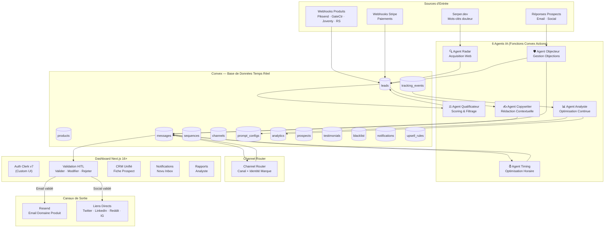
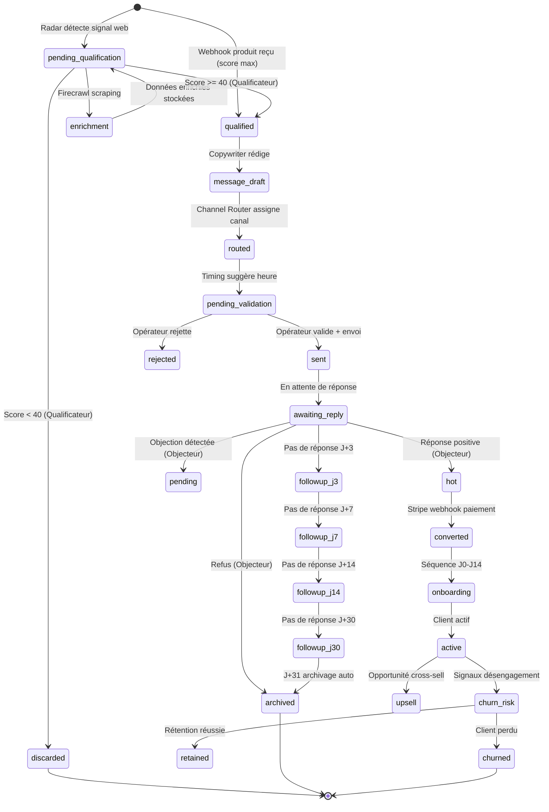
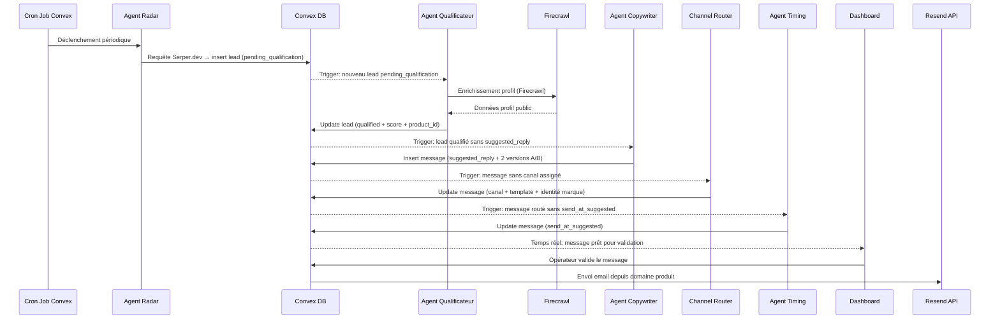
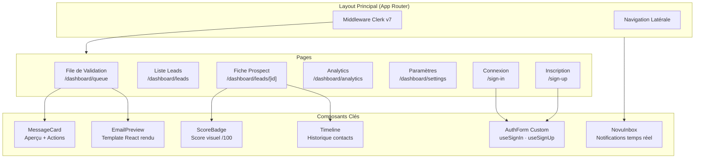
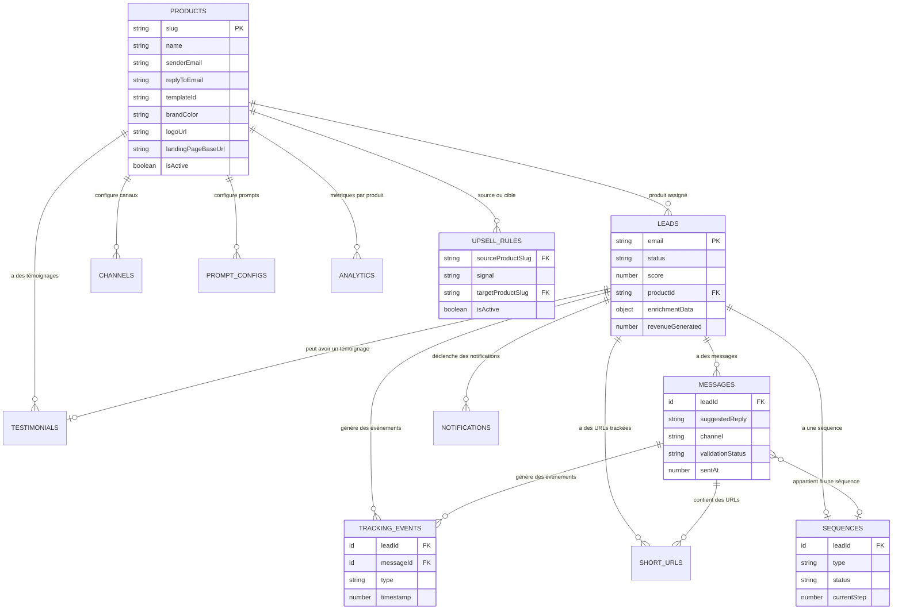
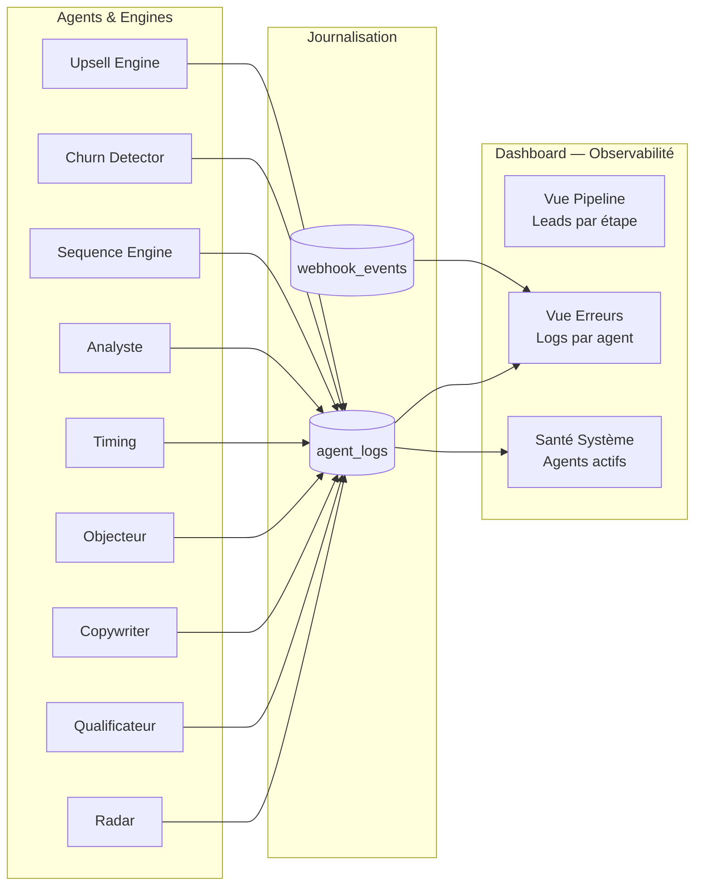

# Document de Design — LeadEngine OS

## Vue d'ensemble

LeadEngine OS est un système distribué event-driven d'orchestration de croissance agentique. Il orchestre 6 agents IA spécialisés qui automatisent le cycle complet d'acquisition, de conversion et de rétention de leads pour 4 produits (Piksend, GateCtr, Joventy, Ryan Sabowa).

### Principes architecturaux

- **Découplage total** : Les agents communiquent exclusivement via la base Convex — aucun appel direct inter-agents.
- **Human-in-the-Loop** : Tout message sortant passe par une validation humaine dans le Dashboard.
- **Event-driven** : Chaque changement d'état en base déclenche les agents concernés via les triggers réactifs de Convex.
- **Observabilité native** : Convex fournit un suivi temps réel de chaque document, permettant de tracer l'état exact d'un lead dans le pipeline.
- **Extensibilité par configuration** : L'ajout d'un nouveau produit se fait par une ligne dans la table `products` + un `prompt_config`, sans modification du code des agents. Toute la configuration produit (emails, templates, couleurs, logos) est data-driven.

### Décisions techniques clés

| Décision | Choix | Justification |
|----------|-------|---------------|
| Backend / DB | Convex | Temps réel natif, triggers réactifs, cron jobs intégrés, type-safety TypeScript end-to-end |
| LLM | Anthropic via Vercel AI SDK | Interface unifiée, streaming natif, structured output via Zod, tool calling |
| Auth | Clerk v7 (hooks headless) | Composants UI custom obligatoires — `useSignIn`, `useSignUp`, `useSession` sans composants pré-construits |
| Email | Resend + React Email | Templates React par produit, envoi depuis domaines dédiés |
| Paiements | Stripe + Webhooks | Conversion tracking, onboarding post-achat |
| Notifications | Novu + Push API | Multi-canal (in-app, push, email), composant `<Inbox />` intégré |
| Dashboard | Next.js 16+ App Router + Tailwind CSS | Server Components, Server Actions, streaming UI |
| Ingestion web | Serper.dev + Firecrawl | Détection de leads + enrichissement profil public |
| Config produits | Table `products` Convex | Configuration data-driven — ajout d'un produit = 1 row + 1 prompt_config, zéro changement de code |
| Hébergement | Vercel | Serverless, déploiement continu, edge functions |

## Architecture

### Architecture système globale



### Flux de données — Cycle de vie d'un lead



### Architecture des agents — Communication via Convex



## Composants et Interfaces

### 1. Agent Radar — Acquisition Web

**Responsabilité** : Détecter des leads potentiels sur le web via Serper.dev et les insérer en base.

**Déclencheur** : Cron job Convex (configurable, par défaut toutes les 2 heures).

**Interface** :
```typescript
// convex/agents/radar.ts
export const runRadarScan = internalAction({
  args: {},
  returns: v.null(),
  handler: async (ctx) => {
    // 1. Charger les mots-clés depuis prompt_configs
    // 2. Requêtes Serper.dev pour chaque mot-clé
    // 3. Dédupliquer par email/identifiant
    // 4. Insérer leads en base (status: "pending_qualification")
    // 5. Journaliser erreurs si échec Serper
  },
});

// Cron job registration
// convex/crons.ts
crons.interval("radar-scan", { hours: 2 }, internal.agents.radar.runRadarScan);
```

**Intégrations** :
- **Serper.dev** : API REST — requêtes de recherche Google avec mots-clés de douleur utilisateur
- **Convex** : Insertion directe via `ctx.runMutation`

### 2. Agent Qualificateur — Scoring & Filtrage

**Responsabilité** : Analyser sémantiquement les leads froids et attribuer un score pondéré /100.

**Déclencheur** : Trigger réactif Convex — détection d'un lead `pending_qualification`.

**Interface** :
```typescript
// convex/agents/qualifier.ts
export const qualifyLead = internalAction({
  args: { leadId: v.id("leads") },
  returns: v.null(),
  handler: async (ctx, { leadId }) => {
    // 1. Lire le lead depuis Convex
    // 2. Déclencher enrichissement Firecrawl
    // 3. Appel LLM Anthropic (Vercel AI SDK) pour analyse sémantique
    // 4. Calculer score pondéré :
    //    - Urgence exprimée: 30 pts
    //    - Source webhook: 25 pts
    //    - Correspondance produit: 20 pts
    //    - Profil actif: 15 pts
    //    - Signaux contextuels: 10 pts
    // 5. Si score >= 40 → status "qualified" + product_id
    // 6. Si score < 40 → status "discarded"
    // 7. Journaliser erreurs LLM
  },
});
```

**Algorithme de scoring** :
```typescript
interface ScoringWeights {
  urgency: 30;        // Mots-clés urgence dans le texte
  webhookSource: 25;  // Lead provenant d'un webhook produit
  productMatch: 20;   // Alignement problème ↔ USP produit
  activeProfile: 15;  // Compte existant, activité récente
  contextSignals: 10; // Profil enrichi, engagement
}

// Le LLM retourne un objet structuré via Zod schema
const ScoringResult = z.object({
  urgency: z.number().min(0).max(30),
  productMatch: z.number().min(0).max(20),
  activeProfile: z.number().min(0).max(15),
  contextSignals: z.number().min(0).max(10),
  bestProduct: z.string(),                    // Slug du produit (validé contre la table `products`)
  reasoning: z.string(),
});
```

### 3. Agent Copywriter — Rédaction Contextuelle

**Responsabilité** : Composer des messages personnalisés sans template figé, avec preuve sociale et lien contextuel.

**Déclencheur** : Lead qualifié détecté sans `suggested_reply`.

**Interface** :
```typescript
// convex/agents/copywriter.ts
export const composeMessage = internalAction({
  args: { leadId: v.id("leads") },
  returns: v.null(),
  handler: async (ctx, { leadId }) => {
    // 1. Charger lead + données enrichies + prompt_config du produit
    // 2. Charger témoignages validés pour le produit
    // 3. Appel LLM Anthropic — ton adapté (Expert/Support/Tech)
    // 4. Si A/B testing activé → générer 2 versions
    // 5. Injecter preuve sociale + lien contextuel (landing page)
    // 6. Stocker dans messages.suggested_reply
  },
});
```

### 4. Channel Router — Routage Canal & Marque

**Responsabilité** : Déterminer le canal de diffusion et l'identité de marque pour chaque message.

**Déclencheur** : Message composé sans canal assigné.

**Interface** :
```typescript
// convex/router/channelRouter.ts
export const routeMessage = internalMutation({
  args: { messageId: v.id("messages") },
  returns: v.null(),
  handler: async (ctx, { messageId }) => {
    // 1. Lire le message et le lead associé
    // 2. Charger la config produit depuis la table `products` (lookup par productId/slug)
    // 3. Déterminer le canal (email ou social) selon les données du lead
    // 4. Résoudre l'identité de marque dynamiquement depuis la config produit
    //    (senderEmail, replyToEmail, templateId, brandColor, logoUrl)
    // 5. Si email → injecter dans template React avec les données produit
    // 6. Si social → préparer lien direct vers la plateforme
    // 7. Générer aperçu visuel
    // 8. Mettre à jour le message avec canal + identité
  },
});

// L'identité de marque est chargée dynamiquement depuis la table `products`
// Exemple de lookup :
// const product = await ctx.db
//   .query("products")
//   .withIndex("by_slug", (q) => q.eq("slug", lead.productId))
//   .unique();
// → product.senderEmail, product.replyToEmail, product.templateId, etc.
// Aucune constante hardcodée — l'ajout d'un produit = 1 row dans `products`.
```

### 5. Agent Timing — Optimisation Horaire

**Responsabilité** : Suggérer l'heure d'envoi optimale sans bloquer l'envoi immédiat.

**Déclencheur** : Message routé sans `send_at_suggested`.

**Interface** :
```typescript
// convex/agents/timing.ts
export const suggestSendTime = internalAction({
  args: { messageId: v.id("messages") },
  returns: v.null(),
  handler: async (ctx, { messageId }) => {
    // 1. Lire le message et le lead associé
    // 2. Déterminer le fuseau horaire du prospect
    // 3. Analyser le niveau d'activité détecté
    // 4. Appliquer les créneaux statistiques (mardi-jeudi matin B2B)
    // 5. Remplir send_at_suggested
  },
});
```

### 6. Agent Objecteur — Gestion des Réponses

**Responsabilité** : Analyser les réponses prospects et catégoriser les objections.

**Déclencheur** : Réponse entrante détectée (email ou social).

**Interface** :
```typescript
// convex/agents/objector.ts
export const analyzeReply = internalAction({
  args: { messageId: v.id("messages"), replyContent: v.string() },
  returns: v.null(),
  handler: async (ctx, { messageId, replyContent }) => {
    // 1. Analyse sémantique LLM de la réponse
    // 2. Catégorisation: trop_cher | reflexion | question_technique | interet | refus
    // 3. Mise à jour statut lead (hot / pending / archived)
    // 4. Génération contre-réponse suggérée si applicable
    // 5. Soumission à validation HITL
  },
});

const ReplyCategory = z.enum([
  "trop_cher",
  "besoin_reflexion",
  "question_technique",
  "interet_confirme",
  "refus",
]);
```

### 7. Agent Analyste — Optimisation Continue

**Responsabilité** : Corréler messages et revenus, A/B testing, optimisation des prompts.

**Déclencheur** : Données de tracking post-envoi + cron hebdomadaire.

**Interface** :
```typescript
// convex/agents/analyst.ts
export const analyzePerformance = internalAction({
  args: {},
  returns: v.null(),
  handler: async (ctx) => {
    // 1. Charger tracking_events récents
    // 2. Corréler messages → conversions Stripe (attribution multi-touch)
    // 3. Évaluer A/B tests en cours (>= 14 jours)
    // 4. Adopter version gagnante si applicable
    // 5. Proposer révisions de prompts si performance insuffisante
    // 6. Générer rapport hebdomadaire
  },
});

export const runABTestEvaluation = internalAction({
  args: {},
  returns: v.null(),
  handler: async (ctx) => {
    // 1. Charger tous les A/B tests actifs depuis >= 14 jours
    // 2. Comparer taux ouverture, clic, réponse
    // 3. Adopter la version gagnante comme standard
    // 4. Mettre à jour prompt_configs
  },
});
```

### 8. Sequence Engine — Moteur de Relance

**Responsabilité** : Orchestrer les séquences de relance (J+3, J+7, J+14, J+30) et l'onboarding post-conversion.

**Déclencheur** : Cron job Convex (vérification quotidienne).

**Interface** :
```typescript
// convex/engine/sequenceEngine.ts
export const processSequences = internalAction({
  args: {},
  returns: v.null(),
  handler: async (ctx) => {
    // 1. Charger toutes les séquences actives
    // 2. Pour chaque séquence, vérifier si le prochain step est dû
    // 3. Si dû → déclencher Agent Copywriter pour rédaction
    // 4. Si J+31 sans réponse → archiver le lead
    // 5. Séquences onboarding: J0, J1, J3, J7, J14
  },
});

// Cron job
crons.interval("sequence-check", { hours: 6 }, internal.engine.sequenceEngine.processSequences);
```

### 9. Churn Detector — Détection de Désengagement

**Responsabilité** : Surveiller les signaux de désengagement et déclencher des actions de rétention.

**Déclencheur** : Cron job + webhooks produits.

```typescript
// convex/engine/churnDetector.ts
export const detectChurnSignals = internalAction({
  args: {},
  returns: v.null(),
  handler: async (ctx) => {
    // 1. Vérifier absence de connexion > 7 jours
    // 2. Détecter chute d'usage > 50% sur 2 semaines
    // 3. Vérifier tickets support > 48h sans réponse
    // 4. Détecter tentatives d'annulation
    // 5. Générer alertes + messages de rétention/downsell
  },
});
```

### 10. Upsell Engine — Ventes Croisées

**Responsabilité** : Détecter les opportunités d'upsell/cross-sell entre les 4 produits.

```typescript
// convex/engine/upsellEngine.ts
// Les règles d'upsell sont stockées dans la table `upsell_rules` en base Convex.
// Aucune constante hardcodée — l'ajout d'une règle = 1 row dans `upsell_rules`.
//
// Exemple de structure d'une règle :
// {
//   sourceProductSlug: "piksend",
//   signal: "api_intensive_usage",
//   targetProductSlug: "gatectr",
//   isActive: true,
// }
//
// Le moteur charge dynamiquement les règles actives :
// const rules = await ctx.db
//   .query("upsell_rules")
//   .withIndex("by_isActive", (q) => q.eq("isActive", true))
//   .collect();
```

### 11. Dashboard — Architecture UI



**Composants d'authentification custom Clerk v7** :
```typescript
// app/(auth)/sign-in/page.tsx
"use client";
import { useSignIn } from "@clerk/nextjs";

export default function SignInPage() {
  const { signIn, isLoaded, setActive } = useSignIn();
  // Formulaire custom avec useSignIn hook
  // Gestion email/password + OAuth
  // Pas de composant <SignIn /> pré-construit
}

// app/(auth)/sign-up/page.tsx
"use client";
import { useSignUp } from "@clerk/nextjs";

export default function SignUpPage() {
  const { signUp, isLoaded, setActive } = useSignUp();
  // Formulaire custom avec useSignUp hook
}
```

### 12. Intégrations Externes

#### Serper.dev — Recherche Web
```typescript
// convex/integrations/serper.ts
interface SerperSearchParams {
  q: string;       // Mot-clé de douleur
  num: number;     // Nombre de résultats (10-100)
  gl?: string;     // Pays cible
  hl?: string;     // Langue
}
// Appel via fetch dans une Convex action
// Résultats parsés et transformés en leads candidats
```

#### Firecrawl — Scraping Profil
```typescript
// convex/integrations/firecrawl.ts
interface FirecrawlScrapeParams {
  url: string;     // URL du profil public
  formats: ["markdown"];
}
// Retourne le contenu structuré du profil
// Stocké dans lead.enrichment_data
```

#### Resend — Envoi Email
```typescript
// convex/integrations/resend.ts
interface SendEmailParams {
  from: string;    // Expéditeur domaine produit
  to: string;      // Email prospect
  replyTo: string; // Reply-to produit
  subject: string;
  react: ReactElement; // Template React Email
}
// Inclut automatiquement le lien de désinscription (RGPD)
// Retourne messageId pour tracking
```

#### Stripe — Webhooks Paiement
```typescript
// convex/http.ts — Route webhook Stripe
http.route({
  path: "/webhooks/stripe",
  method: "POST",
  handler: httpAction(async (ctx, request) => {
    // 1. Vérifier signature Stripe (stripe.webhooks.constructEvent)
    // 2. Extraire event type (checkout.session.completed, etc.)
    // 3. Mettre à jour lead.status → "converted"
    // 4. Enregistrer revenue_generated
    // 5. Déclencher séquence onboarding
  }),
});
```

#### Novu — Notifications
```typescript
// convex/integrations/novu.ts
// Workflows Novu définis pour chaque type d'alerte :
// - critical_lead: Lead score > 85
// - hot_reply: Réponse dans les 2h
// - idle_hot_lead: Lead hot sans action > 4h
// - churn_signal: Signal de désengagement
// - pending_validation: Message en attente > 8h
// - weekly_report: Rapport hebdomadaire
```

### 13. Tracking Comportemental — URLs Courtes

```typescript
// convex/tracking/shortUrls.ts
export const createTrackedUrl = mutation({
  args: {
    originalUrl: v.string(),
    leadId: v.id("leads"),
    messageId: v.id("messages"),
  },
  returns: v.string(),
  handler: async (ctx, args) => {
    // 1. Générer un code court unique (nanoid)
    // 2. Stocker le mapping en base
    // 3. Retourner l'URL courte (ex: https://leos.link/abc123)
  },
});

// convex/http.ts — Route de redirection
http.route({
  path: "/t/:code",
  method: "GET",
  handler: httpAction(async (ctx, request) => {
    // 1. Résoudre le code court
    // 2. Vérifier blacklist du lead
    // 3. Enregistrer tracking_event (clic, timestamp, lead, message)
    // 4. Rediriger vers l'URL originale
  }),
});
```

## Modèles de Données

### Schéma Convex Complet

```typescript
// convex/schema.ts
import { defineSchema, defineTable } from "convex/server";
import { v } from "convex/values";

export default defineSchema({
  // ═══════════════════════════════════════════
  // TABLE PRODUCTS — Configuration dynamique des produits
  // ═══════════════════════════════════════════
  products: defineTable({
    slug: v.string(),                         // Ex: "piksend", "gatectr", "joventy", "ryan_sabowa"
    name: v.string(),                         // Nom d'affichage (ex: "Piksend")
    senderEmail: v.string(),                  // Ex: "hello@piksend.com"
    replyToEmail: v.string(),                 // Ex: "support@piksend.com"
    templateId: v.string(),                   // Ex: "piksend-outreach"
    brandColor: v.string(),                   // Ex: "#FF6B35"
    logoUrl: v.string(),                      // URL du logo produit
    landingPageBaseUrl: v.string(),           // Ex: "https://piksend.com/lp"
    uspDescription: v.optional(v.string()),   // USP pour le Qualificateur
    isActive: v.boolean(),
    createdAt: v.number(),
    updatedAt: v.number(),
  })
    .index("by_slug", ["slug"])
    .index("by_isActive", ["isActive"]),

  // ═══════════════════════════════════════════
  // TABLE UPSELL_RULES — Règles d'upsell/cross-sell configurables
  // ═══════════════════════════════════════════
  upsell_rules: defineTable({
    sourceProductSlug: v.string(),            // Slug du produit source
    signal: v.string(),                       // Signal déclencheur (ex: "api_intensive_usage")
    targetProductSlug: v.string(),            // Slug du produit cible
    description: v.optional(v.string()),      // Description de la règle
    isActive: v.boolean(),
    createdAt: v.number(),
  })
    .index("by_sourceProductSlug", ["sourceProductSlug"])
    .index("by_isActive", ["isActive"]),

  // ═══════════════════════════════════════════
  // TABLE LEADS — Cœur du pipeline
  // ═══════════════════════════════════════════
  leads: defineTable({
    // Identité
    email: v.string(),
    externalId: v.optional(v.string()),       // ID unique cross-canal
    name: v.optional(v.string()),
    
    // Source — pattern dynamique "webhook_{productSlug}" ou "radar"
    source: v.string(),                       // Ex: "radar", "webhook_piksend", "webhook_gatectr", etc.
    sourceUrl: v.optional(v.string()),
    detectedAt: v.number(),                   // Timestamp première détection
    detectionChannel: v.string(),             // Canal d'origine
    
    // Qualification
    status: v.union(
      v.literal("pending_qualification"),
      v.literal("qualified"),
      v.literal("discarded"),
      v.literal("hot"),
      v.literal("pending"),
      v.literal("converted"),
      v.literal("archived"),
      v.literal("churned")
    ),
    score: v.optional(v.number()),            // Score /100
    scoringBreakdown: v.optional(v.object({
      urgency: v.number(),
      webhookSource: v.number(),
      productMatch: v.number(),
      activeProfile: v.number(),
      contextSignals: v.number(),
    })),
    productId: v.optional(v.string()),        // Slug du produit (référence dynamique vers products.slug)
    scoringReasoning: v.optional(v.string()),
    
    // Enrichissement
    enrichmentData: v.optional(v.object({
      linkedinUrl: v.optional(v.string()),
      githubUrl: v.optional(v.string()),
      websiteUrl: v.optional(v.string()),
      bio: v.optional(v.string()),
      skills: v.optional(v.array(v.string())),
      company: v.optional(v.string()),
      role: v.optional(v.string()),
      scrapedAt: v.optional(v.number()),
    })),
    
    // Webhook produit (leads chauds)
    webhookEventType: v.optional(v.string()),
    webhookEventContext: v.optional(v.string()),
    webhookUserId: v.optional(v.string()),
    
    // Conversion
    revenueGenerated: v.optional(v.number()),
    stripeCustomerId: v.optional(v.string()),
    convertedAt: v.optional(v.number()),
    
    // Churn
    churnRiskScore: v.optional(v.number()),
    lastActivityAt: v.optional(v.number()),
    
    // Conformité
    consentSource: v.string(),                // Source du consentement
    consentDate: v.number(),                  // Date du consentement
    
    // Métadonnées
    updatedAt: v.number(),
  })
    .index("by_email", ["email"])
    .index("by_status", ["status"])
    .index("by_status_score", ["status", "score"])
    .index("by_productId", ["productId"])
    .index("by_source", ["source"])
    .index("by_externalId", ["externalId"]),

  // ═══════════════════════════════════════════
  // TABLE MESSAGES — Messages composés et envoyés
  // ═══════════════════════════════════════════
  messages: defineTable({
    leadId: v.id("leads"),
    
    // Contenu
    suggestedReply: v.optional(v.string()),
    suggestedReplyB: v.optional(v.string()),  // Version B pour A/B test
    activeVersion: v.optional(v.union(v.literal("A"), v.literal("B"))),
    finalContent: v.optional(v.string()),     // Contenu validé par l'opérateur
    subject: v.optional(v.string()),          // Sujet email
    
    // Ton et contexte
    tone: v.optional(v.union(
      v.literal("expert"),
      v.literal("support"),
      v.literal("tech")
    )),
    socialProofUsed: v.optional(v.string()),
    contextualLink: v.optional(v.string()),
    
    // Canal et routage
    channel: v.optional(v.union(
      v.literal("email"),
      v.literal("twitter"),
      v.literal("linkedin"),
      v.literal("reddit"),
      v.literal("instagram")
    )),
    brandIdentity: v.optional(v.object({
      sender: v.string(),
      replyTo: v.string(),
      templateId: v.string(),
    })),
    socialDirectLink: v.optional(v.string()), // Lien direct plateforme sociale
    
    // Timing
    sendAtSuggested: v.optional(v.number()),  // Timestamp suggéré par Agent Timing
    sentAt: v.optional(v.number()),           // Timestamp réel d'envoi
    
    // Validation HITL
    validationStatus: v.union(
      v.literal("draft"),
      v.literal("pending_validation"),
      v.literal("approved"),
      v.literal("rejected"),
      v.literal("sent")
    ),
    validatedBy: v.optional(v.string()),      // Clerk userId
    validatedAt: v.optional(v.number()),
    
    // Séquence
    sequenceId: v.optional(v.id("sequences")),
    sequenceStep: v.optional(v.number()),     // 0=initial, 1=J+3, 2=J+7, etc.
    
    // Réponse
    replyContent: v.optional(v.string()),
    replyCategory: v.optional(v.union(
      v.literal("trop_cher"),
      v.literal("besoin_reflexion"),
      v.literal("question_technique"),
      v.literal("interet_confirme"),
      v.literal("refus")
    )),
    replyReceivedAt: v.optional(v.number()),
    
    // Tracking
    resendMessageId: v.optional(v.string()),
    opened: v.optional(v.boolean()),
    openedAt: v.optional(v.number()),
    clicked: v.optional(v.boolean()),
    clickedAt: v.optional(v.number()),
    
    // Métadonnées
    createdAt: v.number(),
    updatedAt: v.number(),
  })
    .index("by_leadId", ["leadId"])
    .index("by_validationStatus", ["validationStatus"])
    .index("by_sequenceId", ["sequenceId"])
    .index("by_channel", ["channel"])
    .index("by_sentAt", ["sentAt"]),

  // ═══════════════════════════════════════════
  // TABLE SEQUENCES — Séquences de relance et onboarding
  // ═══════════════════════════════════════════
  sequences: defineTable({
    leadId: v.id("leads"),
    type: v.union(
      v.literal("outreach"),      // Séquence de relance standard
      v.literal("onboarding")     // Séquence post-conversion
    ),
    status: v.union(
      v.literal("active"),
      v.literal("paused"),
      v.literal("completed"),
      v.literal("cancelled")
    ),
    currentStep: v.number(),       // Step actuel (0-indexed)
    steps: v.array(v.object({
      day: v.number(),             // Jour relatif (0, 3, 7, 14, 30)
      type: v.string(),            // "initial", "relance_1", "valeur", etc.
      angle: v.string(),           // Description de l'angle
      messageId: v.optional(v.id("messages")),
      completedAt: v.optional(v.number()),
    })),
    startedAt: v.number(),
    nextStepDueAt: v.optional(v.number()),
    completedAt: v.optional(v.number()),
  })
    .index("by_leadId", ["leadId"])
    .index("by_status", ["status"])
    .index("by_nextStepDueAt", ["nextStepDueAt"]),

  // ═══════════════════════════════════════════
  // TABLE CHANNELS — Configuration des canaux par produit
  // ═══════════════════════════════════════════
  channels: defineTable({
    productId: v.string(),                    // Slug du produit (référence dynamique vers products.slug)
    type: v.union(v.literal("email"), v.literal("social")),
    config: v.object({
      sender: v.optional(v.string()),
      replyTo: v.optional(v.string()),
      templateId: v.optional(v.string()),
      platform: v.optional(v.string()),
      brandColor: v.optional(v.string()),
      logoUrl: v.optional(v.string()),
    }),
    isActive: v.boolean(),
  })
    .index("by_productId", ["productId"])
    .index("by_type", ["type"]),

  // ═══════════════════════════════════════════
  // TABLE PROMPT_CONFIGS — Prompts des agents par produit
  // ═══════════════════════════════════════════
  prompt_configs: defineTable({
    agentType: v.union(
      v.literal("radar"),
      v.literal("qualifier"),
      v.literal("copywriter"),
      v.literal("objector"),
      v.literal("timing"),
      v.literal("analyst")
    ),
    productId: v.optional(v.string()),        // Slug du produit (référence dynamique vers products.slug)
    promptTemplate: v.string(),
    version: v.number(),
    isActive: v.boolean(),
    keywords: v.optional(v.array(v.string())),  // Mots-clés Radar
    uspDescription: v.optional(v.string()),      // USP produit pour Qualificateur
    performanceScore: v.optional(v.number()),    // Score perf calculé par Analyste
    createdAt: v.number(),
    updatedAt: v.number(),
  })
    .index("by_agentType", ["agentType"])
    .index("by_agentType_productId", ["agentType", "productId"])
    .index("by_isActive", ["isActive"]),

  // ═══════════════════════════════════════════
  // TABLE ANALYTICS — Métriques et rapports
  // ═══════════════════════════════════════════
  analytics: defineTable({
    type: v.union(
      v.literal("weekly_report"),
      v.literal("ab_test_result"),
      v.literal("attribution"),
      v.literal("win_loss")
    ),
    productId: v.optional(v.string()),        // Slug du produit (référence dynamique vers products.slug)
    period: v.optional(v.object({
      start: v.number(),
      end: v.number(),
    })),
    data: v.any(),  // Données flexibles selon le type
    createdAt: v.number(),
  })
    .index("by_type", ["type"])
    .index("by_type_createdAt", ["type", "createdAt"])
    .index("by_productId", ["productId"]),

  // ═══════════════════════════════════════════
  // TABLE TRACKING_EVENTS — Événements comportementaux
  // ═══════════════════════════════════════════
  tracking_events: defineTable({
    leadId: v.id("leads"),
    messageId: v.id("messages"),
    type: v.union(
      v.literal("click"),
      v.literal("open"),
      v.literal("reply"),
      v.literal("unsubscribe"),
      v.literal("conversion")
    ),
    url: v.optional(v.string()),
    timestamp: v.number(),
    metadata: v.optional(v.any()),
  })
    .index("by_leadId", ["leadId"])
    .index("by_messageId", ["messageId"])
    .index("by_type", ["type"])
    .index("by_timestamp", ["timestamp"]),

  // ═══════════════════════════════════════════
  // TABLE SHORT_URLS — URLs courtes pour tracking
  // ═══════════════════════════════════════════
  short_urls: defineTable({
    code: v.string(),              // Code court unique
    originalUrl: v.string(),
    leadId: v.id("leads"),
    messageId: v.id("messages"),
    clickCount: v.number(),
    createdAt: v.number(),
  })
    .index("by_code", ["code"])
    .index("by_leadId", ["leadId"])
    .index("by_messageId", ["messageId"]),

  // ═══════════════════════════════════════════
  // TABLE BLACKLIST — Prospects désinscrits (RGPD)
  // ═══════════════════════════════════════════
  blacklist: defineTable({
    email: v.string(),
    reason: v.union(
      v.literal("unsubscribe"),
      v.literal("manual_removal"),
      v.literal("gdpr_request")
    ),
    addedAt: v.number(),
  })
    .index("by_email", ["email"]),

  // ═══════════════════════════════════════════
  // TABLE TESTIMONIALS — Témoignages clients
  // ═══════════════════════════════════════════
  testimonials: defineTable({
    leadId: v.id("leads"),
    productId: v.string(),                    // Slug du produit (référence dynamique vers products.slug)
    content: v.string(),
    authorName: v.optional(v.string()),
    isValidated: v.boolean(),
    validatedAt: v.optional(v.number()),
    createdAt: v.number(),
  })
    .index("by_productId", ["productId"])
    .index("by_isValidated", ["isValidated"])
    .index("by_productId_isValidated", ["productId", "isValidated"]),

  // ═══════════════════════════════════════════
  // TABLE NOTIFICATIONS — Historique des notifications
  // ═══════════════════════════════════════════
  notifications: defineTable({
    type: v.union(
      v.literal("critical_lead"),
      v.literal("hot_reply"),
      v.literal("idle_hot_lead"),
      v.literal("churn_signal"),
      v.literal("pending_validation"),
      v.literal("weekly_report")
    ),
    priority: v.union(
      v.literal("critical"),
      v.literal("high"),
      v.literal("medium"),
      v.literal("info")
    ),
    title: v.string(),
    body: v.string(),
    leadId: v.optional(v.id("leads")),
    messageId: v.optional(v.id("messages")),
    isRead: v.boolean(),
    sentViaNovu: v.boolean(),
    createdAt: v.number(),
  })
    .index("by_type", ["type"])
    .index("by_isRead", ["isRead"])
    .index("by_priority", ["priority"])
    .index("by_createdAt", ["createdAt"]),

  // ═══════════════════════════════════════════
  // TABLE AGENT_LOGS — Journalisation des agents
  // ═══════════════════════════════════════════
  agent_logs: defineTable({
    agentType: v.union(
      v.literal("radar"),
      v.literal("qualifier"),
      v.literal("copywriter"),
      v.literal("objector"),
      v.literal("timing"),
      v.literal("analyst"),
      v.literal("channel_router"),
      v.literal("sequence_engine"),
      v.literal("churn_detector"),
      v.literal("upsell_engine")
    ),
    level: v.union(
      v.literal("info"),
      v.literal("warn"),
      v.literal("error")
    ),
    message: v.string(),
    leadId: v.optional(v.id("leads")),
    messageId: v.optional(v.id("messages")),
    metadata: v.optional(v.any()),
    timestamp: v.number(),
  })
    .index("by_agentType", ["agentType"])
    .index("by_level", ["level"])
    .index("by_agentType_level", ["agentType", "level"])
    .index("by_timestamp", ["timestamp"]),

  // ═══════════════════════════════════════════
  // TABLE WEBHOOK_EVENTS — Événements webhook entrants
  // ═══════════════════════════════════════════
  webhook_events: defineTable({
    source: v.string(),                       // Ex: "stripe", "piksend", "gatectr", "resend", ou tout nouveau produit
    eventType: v.string(),
    payload: v.any(),
    processed: v.boolean(),
    processedAt: v.optional(v.number()),
    error: v.optional(v.string()),
    receivedAt: v.number(),
  })
    .index("by_source", ["source"])
    .index("by_processed", ["processed"])
    .index("by_receivedAt", ["receivedAt"]),
});
```

### Diagramme Entité-Relation



## Propriétés de Correction (Correctness Properties)

*Une propriété est une caractéristique ou un comportement qui doit rester vrai pour toutes les exécutions valides d'un système — essentiellement, une déclaration formelle de ce que le système doit faire. Les propriétés servent de pont entre les spécifications lisibles par l'humain et les garanties de correction vérifiables par la machine.*

### Property 1 : Complétude de création de lead par le Radar

*Pour tout* résultat de recherche Serper.dev valide transformé en lead, le document lead créé DOIT avoir le statut `pending_qualification` et contenir les champs `source` (= "radar"), `detectedAt` (timestamp valide), `detectionChannel`, `consentSource` et `consentDate`.

**Validates: Requirements 1.2, 1.3, 17.3**

### Property 2 : Déduplification cross-canal des prospects

*Pour tout* ensemble de détections de prospects sur plusieurs canaux partageant le même email, le système DOIT maintenir un seul enregistrement lead par email unique. Toute détection ultérieure sur un nouveau canal DOIT consolider les données dans la fiche existante au lieu de créer un doublon.

**Validates: Requirements 1.5, 15.1, 15.3**

### Property 3 : Création de lead webhook avec statut et routage corrects

*Pour tout* payload webhook produit valide contenant `product_id`, `event_type`, `event_context`, `user_email` et `timestamp`, le lead créé DOIT avoir le statut `qualified`, le score maximum (100), et le `productId` correspondant au `product_id` du payload. Le lead DOIT contourner l'Agent Qualificateur.

**Validates: Requirements 2.1, 2.2**

### Property 4 : Rejet des webhooks invalides

*Pour tout* payload webhook produit auquel il manque un ou plusieurs champs requis (`product_id`, `event_type`, `event_context`, `user_email`, `timestamp`) ou contenant des valeurs de type incorrect, le système DOIT rejeter le webhook avec un code HTTP 400 et ne créer aucun lead.

**Validates: Requirements 2.3**

### Property 5 : Stockage des données d'enrichissement Firecrawl

*Pour toute* réponse Firecrawl valide contenant des données de profil public, le système DOIT stocker les données dans le champ `enrichmentData` du lead avec les sous-champs appropriés (linkedinUrl, githubUrl, websiteUrl, bio, skills, company, role, scrapedAt).

**Validates: Requirements 3.2**

### Property 6 : Bornes du score de qualification

*Pour tout* lead analysé par l'Agent Qualificateur, le score total DOIT être compris entre 0 et 100 inclus, avec chaque composante respectant ses bornes : urgence ≤ 30, webhookSource ≤ 25, productMatch ≤ 20, activeProfile ≤ 15, contextSignals ≤ 10. La somme des composantes DOIT être égale au score total.

**Validates: Requirements 4.2**

### Property 7 : Seuil de score détermine le destin du lead

*Pour tout* lead scoré par l'Agent Qualificateur : si le score est ≥ 40, le statut DOIT être `qualified` et un `productId` valide DOIT être assigné ; si le score est < 40, le statut DOIT être `discarded` et aucun `productId` ne DOIT être assigné.

**Validates: Requirements 4.3, 4.4**

### Property 8 : Message contient preuve sociale et lien contextuel

*Pour tout* message composé par l'Agent Copywriter pour un lead qualifié, le message DOIT contenir une référence à la preuve sociale du produit assigné et un lien contextuel vers la landing page dédiée. Si des données d'enrichissement sont disponibles, elles DOIVENT être reflétées dans le contenu du message.

**Validates: Requirements 5.3, 3.4**

### Property 9 : A/B testing génère deux versions distinctes

*Pour tout* lead qualifié avec l'A/B testing activé, l'Agent Copywriter DOIT générer deux versions de message (`suggestedReply` et `suggestedReplyB`) qui sont toutes deux non-vides et différentes l'une de l'autre.

**Validates: Requirements 5.4**

### Property 10 : Routage canal et identité de marque corrects

*Pour tout* message avec un produit assigné, le Channel Router DOIT charger la configuration du produit depuis la table `products` et assigner un canal valide (email ou social) avec l'identité de marque correspondante. Pour les emails : l'expéditeur DOIT correspondre au champ `senderEmail` du produit et le reply-to au champ `replyToEmail`. Pour les messages sociaux : un lien direct vers la plateforme cible DOIT être fourni. L'ajout d'un nouveau produit dans la table `products` DOIT être suffisant pour que le routage fonctionne sans modification de code.

**Validates: Requirements 6.1, 6.2, 6.3, 6.4, 20.5**

### Property 11 : Messages triés par score décroissant dans la file de validation

*Pour tout* ensemble de messages en attente de validation retournés par la requête Dashboard, les messages DOIVENT être ordonnés par score de lead décroissant.

**Validates: Requirements 7.1**

### Property 12 : Invariant Human-in-the-Loop — Aucun envoi sans validation

*Pour tout* message dans le système ayant un `sentAt` défini, le `validationStatus` DOIT être `approved` et le `validatedBy` DOIT être non-null. Cet invariant s'applique à tous les types de messages : initiaux, relances, contre-réponses, rétention, downsell et upsell.

**Validates: Requirements 7.8, 9.6, 10.6, 12.5, 13.5**

### Property 13 : Moteur de séquence déclenche le bon step au bon moment

*Pour toute* séquence active de type "outreach", le moteur de séquence DOIT déclencher le step suivant au jour correct relatif au message initial : step 1 à J+3, step 2 à J+7, step 3 à J+14, step 4 à J+30. Chaque step déclenché DOIT créer un message avec le `sequenceStep` correspondant.

**Validates: Requirements 9.1, 9.2, 9.3, 9.4**

### Property 14 : Archivage automatique à J+31

*Pour tout* lead avec une séquence outreach active ayant dépassé 31 jours sans réponse, le système DOIT archiver automatiquement le lead (statut `archived`) et marquer la séquence comme `completed`.

**Validates: Requirements 9.5**

### Property 15 : Catégorie de réponse détermine la transition de statut du lead

*Pour toute* réponse analysée par l'Agent Objecteur : si la catégorie est `interet_confirme`, le statut du lead DOIT devenir `hot` ; si la catégorie est `refus`, le statut DOIT devenir `archived` ; si la catégorie est `trop_cher`, `besoin_reflexion` ou `question_technique`, le statut DOIT devenir `pending` et une contre-réponse suggérée DOIT être générée.

**Validates: Requirements 10.2, 10.3, 10.4, 10.5**

### Property 16 : Conversion Stripe met à jour le lead et déclenche l'onboarding

*Pour tout* webhook Stripe de paiement réussi avec un lead correspondant en base, le statut du lead DOIT devenir `converted`, le `revenueGenerated` DOIT correspondre au montant du paiement, et une séquence d'onboarding DOIT être créée avec les steps J0, J1, J3, J7, J14.

**Validates: Requirements 11.1, 11.2**

### Property 17 : Détection de churn aux seuils corrects

*Pour tout* client converti : si `lastActivityAt` dépasse 7 jours, une alerte de priorité haute DOIT être générée ; si une chute d'usage > 50% est détectée sur 2 semaines, un message de rétention DOIT être suggéré ; si un ticket support est ouvert depuis > 48h, une escalade DOIT être déclenchée.

**Validates: Requirements 12.1, 12.2, 12.3**

### Property 18 : Attribution multi-touch somme à 100%

*Pour tout* ensemble de touchpoints menant à une conversion, les pourcentages d'attribution DOIVENT sommer à exactement 100%. Chaque touchpoint DOIT recevoir un pourcentage ≥ 0.

**Validates: Requirements 14.1**

### Property 19 : Évaluation A/B sélectionne le gagnant correct

*Pour tout* A/B test actif depuis ≥ 14 jours avec des métriques de performance (taux d'ouverture, clic, réponse), la version avec le score combiné le plus élevé DOIT être adoptée comme standard. La version perdante DOIT être désactivée.

**Validates: Requirements 14.2**

### Property 20 : Prospects blacklistés exclus de toute activité sortante

*Pour tout* email présent dans la table `blacklist`, le système DOIT bloquer l'envoi de tout message à cette adresse ET exclure le prospect de tout tracking comportemental. Aucun `tracking_event` ne DOIT être créé pour un prospect blacklisté.

**Validates: Requirements 17.6, 18.4**

### Property 21 : Lien de désinscription dans chaque email

*Pour tout* email envoyé via Resend, le contenu DOIT inclure un lien de désinscription fonctionnel conforme RGPD/CAN-SPAM.

**Validates: Requirements 17.1**

### Property 22 : Désinscription → ajout immédiat à la blacklist

*Pour tout* clic sur un lien de désinscription, l'email du prospect DOIT être immédiatement ajouté à la table `blacklist` et tout contact futur DOIT cesser.

**Validates: Requirements 17.2**

### Property 23 : Suppression des leads archivés après 12 mois

*Pour tout* lead avec le statut `archived` dont la date d'archivage dépasse 12 mois, le cron job de nettoyage DOIT supprimer le lead et toutes ses données associées.

**Validates: Requirements 17.4**

### Property 24 : URLs courtes générées pour chaque lien dans un message

*Pour tout* message contenant des URLs, chaque URL DOIT être remplacée par une URL courte trackée. Chaque URL courte DOIT être associée au `leadId` et au `messageId` source.

**Validates: Requirements 18.1**

### Property 25 : Clic sur URL trackée enregistre un événement

*Pour tout* clic sur une URL courte trackée, un `tracking_event` de type `click` DOIT être créé avec le `leadId`, le `messageId`, l'URL originale et le timestamp du clic.

**Validates: Requirements 18.2**

### Property 26 : Notifications déclenchées aux seuils de priorité corrects

*Pour tout* événement système : un lead avec score > 85 DOIT déclencher une notification `critical` ; une réponse reçue dans les 2h post-envoi DOIT déclencher une notification `high` ; un lead `hot` sans action depuis > 4h DOIT déclencher une notification `high` ; un message en attente de validation depuis > 8h DOIT déclencher une notification `medium`.

**Validates: Requirements 16.1, 16.2, 16.3, 16.5**

### Property 27 : Lead a toujours un statut de pipeline valide

*Pour tout* lead dans le système, le champ `status` DOIT toujours contenir une valeur parmi : `pending_qualification`, `qualified`, `discarded`, `hot`, `pending`, `converted`, `archived`, `churned`.

**Validates: Requirements 20.2**

## Gestion des Erreurs

### Stratégie globale

LeadEngine OS adopte une approche **fail-safe par agent** : une erreur dans un agent ne doit jamais bloquer le pipeline ni affecter les autres agents. Chaque erreur est journalisée dans la table `agent_logs` pour diagnostic.

### Patterns de gestion d'erreurs par composant

#### 1. Erreurs d'intégrations externes (Serper, Firecrawl, Resend, Stripe, Novu)

| Intégration | Stratégie | Retry | Fallback |
|-------------|-----------|-------|----------|
| Serper.dev | Log erreur + retry au prochain cron cycle | Automatique (cron) | Aucun lead créé — pas de données corrompues |
| Firecrawl | Log erreur + continuer pipeline sans enrichissement | 1 retry immédiat | Lead continue avec données disponibles |
| Resend | Log erreur + message reste en `approved` pour retry | 3 retries avec backoff exponentiel | Notification Dashboard pour intervention manuelle |
| Stripe webhook | Log erreur + webhook stocké pour retraitement | Stripe retry natif (jusqu'à 72h) | Événement journalisé pour investigation |
| Novu | Log erreur + notification stockée en base | 2 retries | Notification visible uniquement dans le Dashboard |

#### 2. Erreurs LLM (Anthropic via Vercel AI SDK)

```typescript
// Pattern commun pour tous les agents utilisant le LLM
async function callLLMWithFallback(params: LLMCallParams): Promise<LLMResult> {
  try {
    const result = await generateObject({
      model: anthropic("claude-sonnet-4-20250514"),
      schema: params.schema,
      prompt: params.prompt,
      maxRetries: 2,
    });
    return { success: true, data: result.object };
  } catch (error) {
    // Journaliser dans agent_logs
    await ctx.runMutation(internal.logs.createLog, {
      agentType: params.agentType,
      level: "error",
      message: `LLM call failed: ${error.message}`,
      leadId: params.leadId,
    });
    // Le lead reste dans son état actuel pour retraitement
    return { success: false, error: error.message };
  }
}
```

**Comportement par agent en cas d'erreur LLM** :
- **Qualificateur** : Lead reste `pending_qualification` → retraité au prochain cycle
- **Copywriter** : Lead marqué pour retraitement → pas de `suggested_reply` généré
- **Objecteur** : Réponse stockée brute → notification Dashboard pour traitement manuel
- **Timing** : Message envoyable sans suggestion horaire → l'opérateur choisit l'heure
- **Analyste** : Rapport incomplet → journalisé, retry au prochain cycle hebdomadaire

#### 3. Erreurs de validation webhook

```typescript
// convex/http.ts — Validation commune
function validateWebhookPayload(payload: unknown, validProductSlugs: string[]): ValidationResult {
  const schema = z.object({
    product_id: z.string().refine((val) => validProductSlugs.includes(val), {
      message: "product_id must match an active product slug",
    }),
    event_type: z.string().min(1),
    event_context: z.string(),
    user_email: z.string().email(),
    timestamp: z.string().datetime(),
  });
  
  const result = schema.safeParse(payload);
  if (!result.success) {
    return { valid: false, errors: result.error.issues };
  }
  return { valid: true, data: result.data };
}
// validProductSlugs est chargé dynamiquement depuis la table `products`
// → const products = await ctx.db.query("products").withIndex("by_isActive", q => q.eq("isActive", true)).collect();
// → const validProductSlugs = products.map(p => p.slug);
```

#### 4. Erreurs de conformité (RGPD)

- **Blacklist check** : Vérifié AVANT tout envoi. Si la vérification échoue (erreur DB), le message est bloqué par défaut (fail-safe).
- **Suppression RGPD** : Opération transactionnelle — toutes les données associées sont supprimées ou aucune. En cas d'échec partiel, l'opération est rejouée.
- **Cron nettoyage 12 mois** : Traitement par lots (batch) pour éviter les timeouts. Leads non supprimés sont retraités au prochain cycle.

### Observabilité



**Métriques clés exposées dans le Dashboard** :
- Nombre de leads par étape du pipeline (temps réel via Convex subscriptions)
- Taux d'erreur par agent (dernières 24h)
- Temps moyen de traitement par agent
- File d'attente de messages en validation
- Webhooks en erreur non traités

## Stratégie de Test

### Approche duale

LeadEngine OS utilise une stratégie de test à deux niveaux complémentaires :

1. **Tests unitaires (example-based)** : Vérifient des scénarios spécifiques, des cas limites et des conditions d'erreur.
2. **Tests property-based** : Vérifient les propriétés universelles sur un large espace d'entrées générées aléatoirement.

### Bibliothèque de Property-Based Testing

**Choix : [fast-check](https://github.com/dubzzz/fast-check)** — la bibliothèque PBT de référence pour TypeScript/JavaScript.

- Intégration native avec Vitest (test runner recommandé pour Next.js + Convex)
- Générateurs riches pour strings, numbers, objects, arrays
- Shrinking automatique pour trouver le cas minimal en échec
- Support des générateurs custom pour les types métier (Lead, Message, etc.)

### Configuration PBT

```typescript
// Chaque test property-based doit :
// 1. Exécuter minimum 100 itérations
// 2. Référencer la propriété du design document
// 3. Utiliser le format de tag standardisé

// Exemple de configuration
fc.assert(
  fc.property(
    arbitraryLead(), // Générateur custom
    (lead) => {
      // ... assertion
    }
  ),
  { numRuns: 100 } // Minimum 100 itérations
);
// Tag: Feature: leadengine-os, Property 6: Bornes du score de qualification
```

### Générateurs custom (Arbitraries)

```typescript
// test/arbitraries/lead.ts
import fc from "fast-check";

export const arbitraryProductId = () =>
  fc.stringMatching(/^[a-z][a-z0-9_]{1,30}$/);  // Slug dynamique — pas de liste hardcodée

export const arbitraryLeadStatus = () =>
  fc.constantFrom(
    "pending_qualification", "qualified", "discarded",
    "hot", "pending", "converted", "archived", "churned"
  );

export const arbitraryScoringBreakdown = () =>
  fc.record({
    urgency: fc.integer({ min: 0, max: 30 }),
    webhookSource: fc.integer({ min: 0, max: 25 }),
    productMatch: fc.integer({ min: 0, max: 20 }),
    activeProfile: fc.integer({ min: 0, max: 15 }),
    contextSignals: fc.integer({ min: 0, max: 10 }),
  });

export const arbitraryProduct = () =>
  fc.record({
    slug: fc.stringMatching(/^[a-z][a-z0-9_]{1,30}$/),
    name: fc.string({ minLength: 1, maxLength: 50 }),
    senderEmail: fc.emailAddress(),
    replyToEmail: fc.emailAddress(),
    templateId: fc.stringMatching(/^[a-z][a-z0-9-]{1,30}$/),
    brandColor: fc.stringMatching(/^#[0-9A-Fa-f]{6}$/),
    logoUrl: fc.webUrl(),
    landingPageBaseUrl: fc.webUrl(),
    isActive: fc.boolean(),
    createdAt: fc.integer({ min: 1700000000000, max: 1800000000000 }),
    updatedAt: fc.integer({ min: 1700000000000, max: 1800000000000 }),
  });

export const arbitraryLead = () =>
  fc.record({
    email: fc.emailAddress(),
    source: fc.oneof(
      fc.constant("radar"),
      arbitraryProductId().map((slug) => `webhook_${slug}`)
    ),
    status: arbitraryLeadStatus(),
    score: fc.option(fc.integer({ min: 0, max: 100 })),
    productId: fc.option(arbitraryProductId()),
    detectedAt: fc.integer({ min: 1700000000000, max: 1800000000000 }),
    detectionChannel: fc.constantFrom("web", "email", "webhook"),
    consentSource: fc.string({ minLength: 1 }),
    consentDate: fc.integer({ min: 1700000000000, max: 1800000000000 }),
    updatedAt: fc.integer({ min: 1700000000000, max: 1800000000000 }),
  });

export const arbitraryWebhookPayload = () =>
  fc.record({
    product_id: arbitraryProductId(),
    event_type: fc.stringMatching(/^[a-z_]+$/),
    event_context: fc.string({ minLength: 1, maxLength: 500 }),
    user_email: fc.emailAddress(),
    timestamp: fc.date().map((d) => d.toISOString()),
  });

export const arbitraryMessage = () =>
  fc.record({
    suggestedReply: fc.option(fc.string({ minLength: 10, maxLength: 2000 })),
    channel: fc.option(fc.constantFrom("email", "twitter", "linkedin", "reddit", "instagram")),
    validationStatus: fc.constantFrom("draft", "pending_validation", "approved", "rejected", "sent"),
    tone: fc.option(fc.constantFrom("expert", "support", "tech")),
  });

export const arbitraryReplyCategory = () =>
  fc.constantFrom(
    "trop_cher", "besoin_reflexion", "question_technique",
    "interet_confirme", "refus"
  );

export const arbitrarySequenceStep = () =>
  fc.record({
    day: fc.constantFrom(0, 3, 7, 14, 30),
    type: fc.constantFrom("initial", "relance_1", "relance_2", "valeur", "reactivation"),
    angle: fc.string({ minLength: 5, maxLength: 200 }),
  });
```

### Plan de tests par propriété

| Propriété | Type de test | Itérations | Générateur principal |
|-----------|-------------|------------|---------------------|
| P1 : Complétude création lead Radar | Property | 100 | arbitrarySerperResult |
| P2 : Déduplification cross-canal | Property | 100 | arbitraryLeadDetections |
| P3 : Création lead webhook | Property | 100 | arbitraryWebhookPayload |
| P4 : Rejet webhooks invalides | Property | 100 | arbitraryInvalidPayload |
| P5 : Stockage enrichissement | Property | 100 | arbitraryFirecrawlResponse |
| P6 : Bornes du score | Property | 100 | arbitraryScoringBreakdown |
| P7 : Seuil score → destin lead | Property | 100 | arbitraryScoredLead |
| P8 : Message contient preuve sociale | Property | 100 | arbitraryQualifiedLead |
| P9 : A/B testing 2 versions | Property | 100 | arbitraryABTestLead |
| P10 : Routage canal et marque | Property | 100 | arbitraryRoutableMessage |
| P11 : Tri par score décroissant | Property | 100 | arbitraryMessageList |
| P12 : Invariant HITL | Property | 100 | arbitrarySentMessage |
| P13 : Séquence step timing | Property | 100 | arbitraryActiveSequence |
| P14 : Archivage J+31 | Property | 100 | arbitraryExpiredSequence |
| P15 : Catégorie réponse → statut | Property | 100 | arbitraryAnalyzedReply |
| P16 : Conversion Stripe | Property | 100 | arbitraryStripeEvent |
| P17 : Détection churn seuils | Property | 100 | arbitraryClientActivity |
| P18 : Attribution somme 100% | Property | 100 | arbitraryTouchpoints |
| P19 : Évaluation A/B gagnant | Property | 100 | arbitraryABTestResults |
| P20 : Blacklist bloque tout | Property | 100 | arbitraryBlacklistedProspect |
| P21 : Lien désinscription | Property | 100 | arbitraryEmailMessage |
| P22 : Désinscription → blacklist | Property | 100 | arbitraryUnsubscribeEvent |
| P23 : Suppression 12 mois | Property | 100 | arbitraryArchivedLead |
| P24 : URLs courtes générées | Property | 100 | arbitraryMessageWithLinks |
| P25 : Clic tracking enregistré | Property | 100 | arbitraryClickEvent |
| P26 : Notifications seuils | Property | 100 | arbitrarySystemEvent |
| P27 : Statut pipeline valide | Property | 100 | arbitraryLead |

### Tests unitaires (example-based)

Les tests unitaires couvrent les scénarios spécifiques non couverts par les property tests :

| Scénario | Type | Requirement |
|----------|------|-------------|
| Erreur Serper → journalisation | Example | 1.4 |
| Validation signature webhook produit | Example | 2.4 |
| Firecrawl échoue → pipeline continue | Example | 3.3 |
| Erreur LLM Qualificateur → lead reste pending | Example | 4.6 |
| Erreur LLM Copywriter → lead marqué retry | Example | 5.6 |
| Aperçu visuel généré pour message | Example | 6.5 |
| Validation/modification/rejet message | Example | 7.2 |
| Auth Clerk v7 protège les routes | Smoke | 7.6, 7.7 |
| Envoi immédiat possible malgré suggestion timing | Example | 8.4 |
| Tentative annulation → downsell | Example | 12.4 |
| Upsell rules (4 règles spécifiques) | Example | 13.1-13.4 |
| Performance insuffisante → révision prompt | Example | 14.3 |
| Webhook Stripe sans lead → journalisation | Example | 11.4 |
| Validation signature Stripe | Example | 11.3 |
| Droit à l'effacement RGPD | Example | 17.5 |
| Témoignage validé → disponible Copywriter | Example | 19.2 |
| Nouveau produit via `products` + `prompt_config` (zéro code) | Example | 20.5 |

### Tests d'intégration

| Scénario | Requirement |
|----------|-------------|
| Pipeline complet : Radar → Qualificateur → Copywriter → Router → Dashboard | 1-7 |
| Pipeline webhook : Webhook → Copywriter → Router → Dashboard → Resend | 2, 5-7 |
| Séquence complète : Message initial → Relances → Archivage | 9 |
| Conversion : Stripe webhook → Onboarding séquence | 11 |
| Churn : Signal détecté → Alerte → Message rétention | 12 |
| Notifications : Événement → Novu → Push/Dashboard | 16 |

### Structure des fichiers de test

```
tests/
├── unit/
│   ├── agents/
│   │   ├── radar.test.ts
│   │   ├── qualifier.test.ts
│   │   ├── copywriter.test.ts
│   │   ├── objector.test.ts
│   │   ├── timing.test.ts
│   │   └── analyst.test.ts
│   ├── engine/
│   │   ├── sequenceEngine.test.ts
│   │   ├── churnDetector.test.ts
│   │   └── upsellEngine.test.ts
│   ├── router/
│   │   └── channelRouter.test.ts
│   └── tracking/
│       └── shortUrls.test.ts
├── properties/
│   ├── arbitraries/
│   │   ├── lead.ts
│   │   ├── message.ts
│   │   ├── sequence.ts
│   │   ├── webhook.ts
│   │   └── tracking.ts
│   ├── scoring.property.test.ts        # P6, P7
│   ├── leadCreation.property.test.ts   # P1, P2, P3, P4
│   ├── enrichment.property.test.ts     # P5
│   ├── messaging.property.test.ts      # P8, P9, P10, P11
│   ├── hitl.property.test.ts           # P12
│   ├── sequence.property.test.ts       # P13, P14
│   ├── objector.property.test.ts       # P15
│   ├── conversion.property.test.ts     # P16
│   ├── churn.property.test.ts          # P17
│   ├── analytics.property.test.ts      # P18, P19
│   ├── compliance.property.test.ts     # P20, P21, P22, P23
│   ├── tracking.property.test.ts       # P24, P25
│   ├── notifications.property.test.ts  # P26
│   └── pipeline.property.test.ts       # P27
└── integration/
    ├── fullPipeline.test.ts
    ├── webhookPipeline.test.ts
    ├── sequenceFlow.test.ts
    ├── stripeConversion.test.ts
    └── churnRetention.test.ts
```
